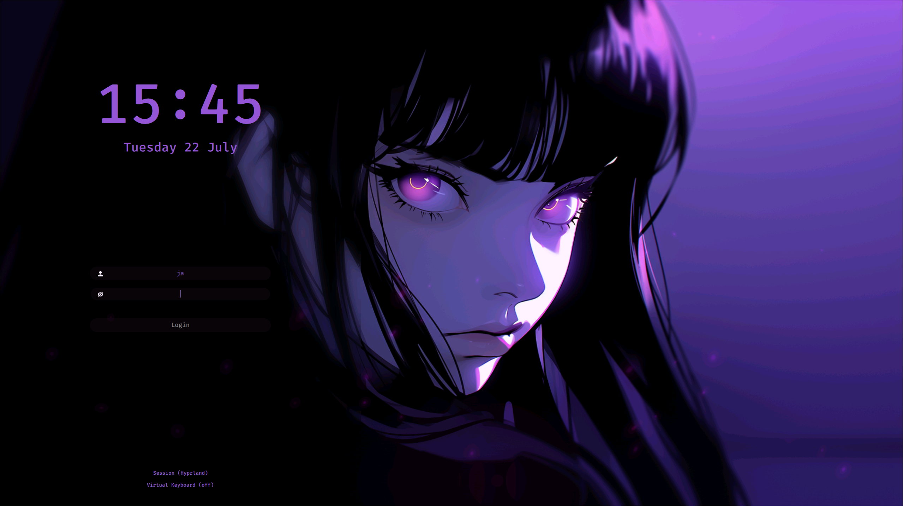
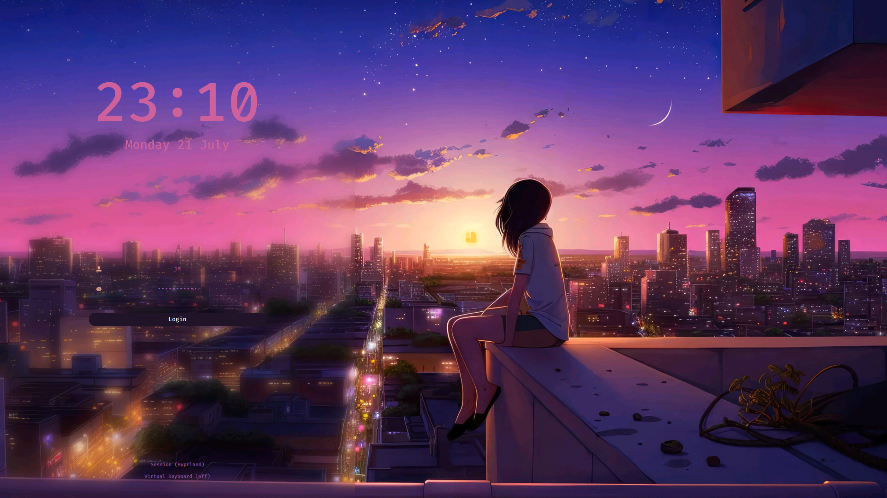

<h2 align="center">🗼 Simple SDDM Theme 2 - QT6 🗼</h2>

<h1 align="center"> This will be the SDDM version 2 theme to be installed in my Hyprland Scripts</h1>

<p align=center>
A Simple theme variant for the <a href="https://github.com/sddm/sddm">SDDM Login Manager</a>
</p>

<h2 align=center>Preview</h2>
<center>

<details>
<summary align=center>More Previews</summary>



</details>
</center>

## Install
> _Assumes that you've installed and configured SDDM correctly_ (if not [read more](https://wiki.archlinux.org/title/SDDM))

>  Please make sure you have the following dependencies installed:

[`sddm >= 0.21.0`](https://github.com/sddm/sddm), [`qt6 >= 6.8`](https://doc.qt.io/qt-6/index.html), [`qt6-svg >= 6.8`](https://doc.qt.io/qt-6/qtsvg-index.html), [`qt6-virtualkeyboard >= 6.8`](https://doc.qt.io/qt-6/qtvirtualkeyboard-index.html), [`qt6-multimedia >= 6.8`](https://doc.qt.io/qt-6/qtmultimedia-index.html)

- [`For Arch Linux`]
`sddm` `qt6-svg` `qt6-virtualkeyboard` `qt6-multimedia-ffmpeg`

- [`For Fedora Linux`]
`sddm` `qt6-qtsvg` `qt6-qtvirtualkeyboard` `qt6-qtmultimedia`

- [`For OpenSuse TW`]
`sddm-qt6` `libQt6Svg6` `qt6-virtualkeyboard` `qt6-virtualkeyboard-imports` `qt6-multimedia` `qt6-multimedia-imports`  

- [`For Debian/ubuntu`]
`sddm` `libqt6svg6` `qt6-virtualkeyboard-plugin` `libqt6multimedia6` `qml6-module-qtquick-controls` `qml6-module-qtquick-effects`

## Configure

Edit the or create if it does not exist `/etc/sddm.conf` (with any text editor with **raised** privileges), so that it looks like this:

```bash
sudo nano /etc/sddm.conf # use any text editor with raised privileges
```

add this lines

```sh
[Theme]
Current=simple_sddm_2

[General]
InputMethod=qtvirtualkeyboard

```


### Language and time format
- By default, it is configured with 24H format. You can change to AM/PM variant by editing the theme.conf
```bash
sudo nano /usr/share/sddm/themes/simple_sddm_2/theme.conf  # use any text editor with raised privileges
```
- `HourFormat="hh:mm AP` . Make sure to disable the above of this part

### 🖼️ Default SDDM background
- To change the default background, put desired image in the `/usr/share/sddm/themes/simple_sddm_2/Backgrounds/` folder and add the name of the image followed by its extension (`.jpg` or `.png`) in `theme.conf` file.

- You can also customize it further if you wish in the `/usr/share/sddm/themes/simple_sddm_2/theme.conf`
(blur, form position, etc).


## Credits
- Theme is based on [`LINK`](https://github.com/Keyitdev/sddm-astronaut-theme) by [**Keyitdev**](https://github.com/Keyitdev)


